# Procesverslag intro
deze 5 weken ben ik hard aan het werk gegegaan. 
Ik moet eerlijk zeggen ik vond dit heel lastig. 
Zelf heb ik hier een hoop uren aan besteed alleen waar ik het groost tegen aan liep is dat ik nog niet goed eerst de basis code snapte. Dit koste mij ongeveer twee tot drie weken om dit echt bij te werken. 

Ik heb tijdens deze 5 weken hulp uitleg gehad gehad van de volgende mensen:

De docent
Ali 
ronald 
studenten assitenten ( als iemand mij heeft geholpen dan zie je daar ook een comment bij)
School oefeningen
hulp bronnen ( die je onder aan de pagina kan vinden bij de bronnen lijst )

## Jij

  ### Auteur:
  Zoe Ros 

  #### Je startniveau:
 Blauw

  #### Je focus:
  surface plane

  Ik had eerst responsive gekozen, maar al snel kwam ik er achter dat de vormaten op al de drie te schermen iets te lastig voor me was dus ik ben in de eerste week geswitch nar surface plane. 

  Met surface plane werk je met animaties. 
 

## Je website

 

  ### Je opdracht:
Voor de opdracht gingen we twee pagina nameken van een webiste naar keuzen. Ik had eerst voor de disney website gekozen. Maar later kwam ik er achter dat deze pagina niet goed bij me paste en toen ben ik naar de nintendo website gegegaan. 

Zelf na onderzoek te doen naar de nintendo webiste ben ik er achter gekemen dat ik deze website erg lastig vond en toch niet goed bij mijn niveau vond passen.

Dus ben ik gaan kijken naar de efteling webiste omdat ik zelf erg fan ben van de efteling. 

### Pagina 1 Efteling 
Voor mijn eerste pagina wil ik graag de overnachting pagina doen.
  https://www.efteling.com/nl/overnachten

### Pagina 2 Efteling
  Voor mijn tweede pagina wil ik graag de pagina van de winter efteling gaan doen.
  https://www.efteling.com/nl/park/events/winter-efteling
  

  #### Screenshot(s) van de eerste pagina (small screen): 
 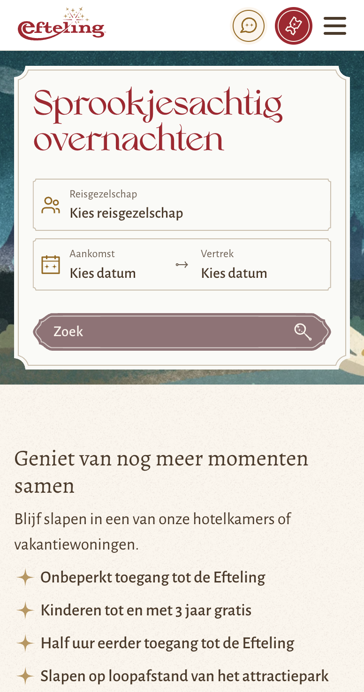
  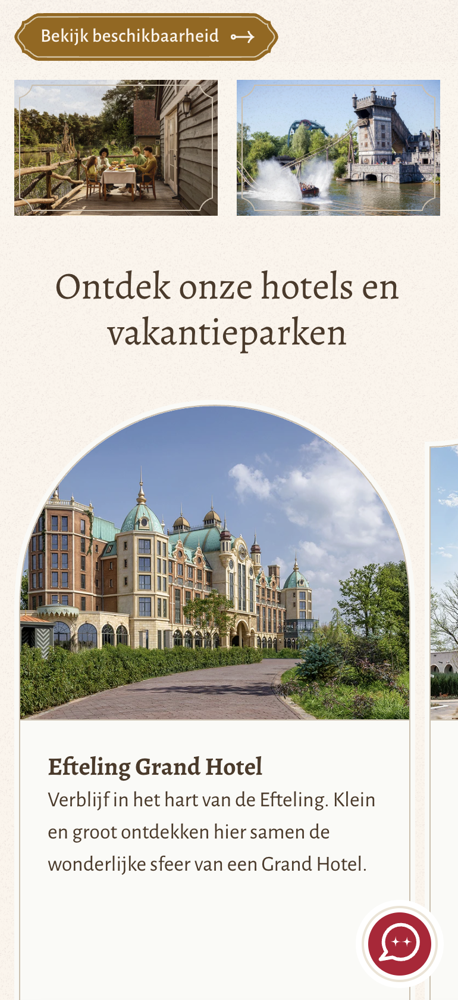
  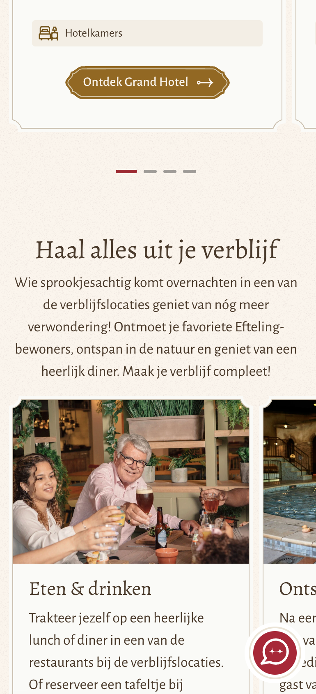
  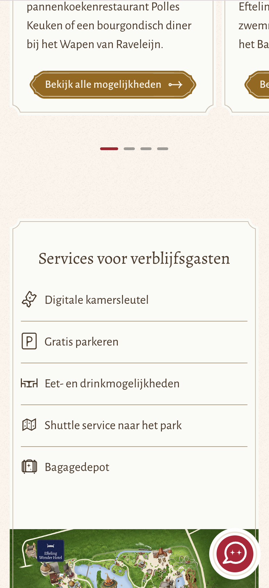
  

  Op deze pagina kan je kijken naar een efteling overnachting.
  Ook zie je de verschillende hotels waar je kan overnachten
  En waar je heerlijk kan ontspannen en kan gaan eten en drinken.
  Daarna kan je de efteling kaart vinden.

  #### Screenshot(s) van de tweede pagina (small screen):
  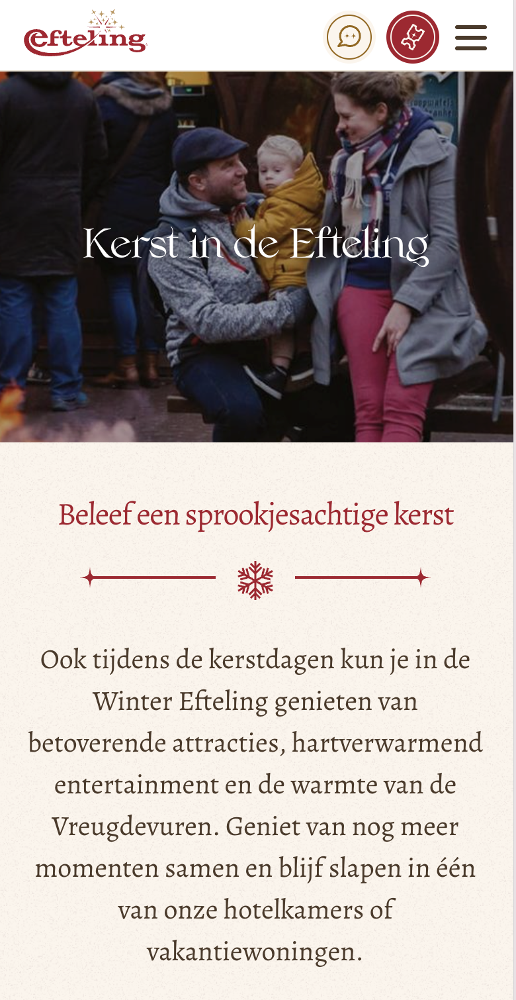
  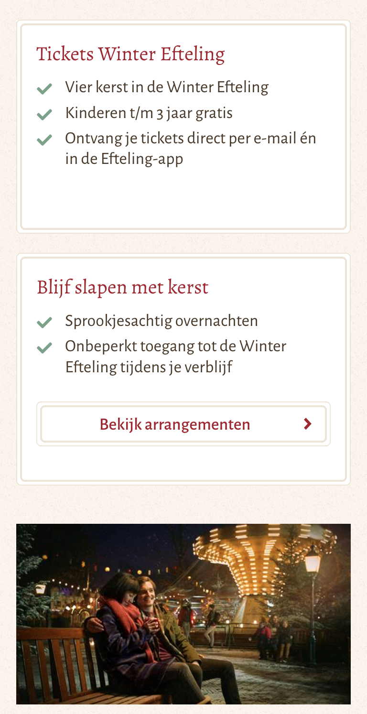
  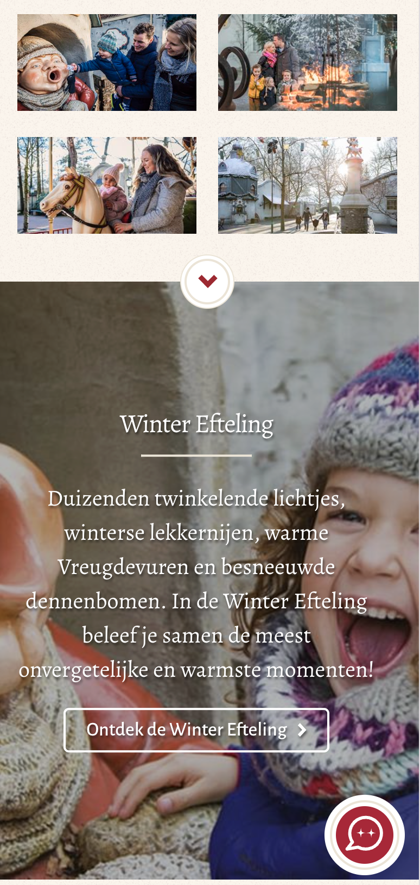
  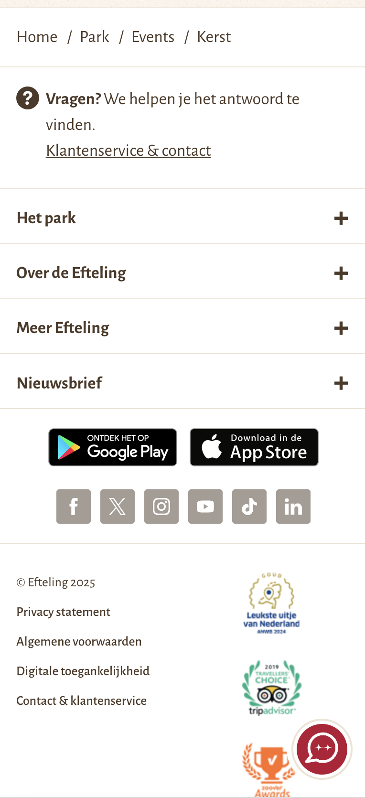
  

Bij de tweede twee pagina wordt je voor bereid op een prachtige winter efteling. Ook vind je de voordelen van naar de winter efteling gaan. En waarom het zp leuk is om tijdens de kerst te blijven slapen.

 

## Toegankelijkheidstest 1/2 (week 1)
Voorwoord: We gaan onderzoek doen en meer leren over de wetregeling van de WCAG check. 
Deze regeling is heel erg belangerijk omdat het een geaccepteerd standaard is voor toegankelijkheid voor websites.

### eerste toegankelijkheidtest Nintendo
 
  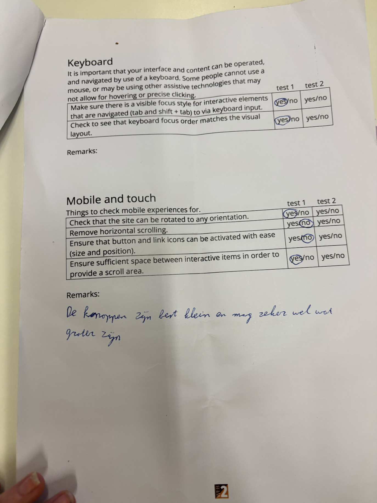
   
    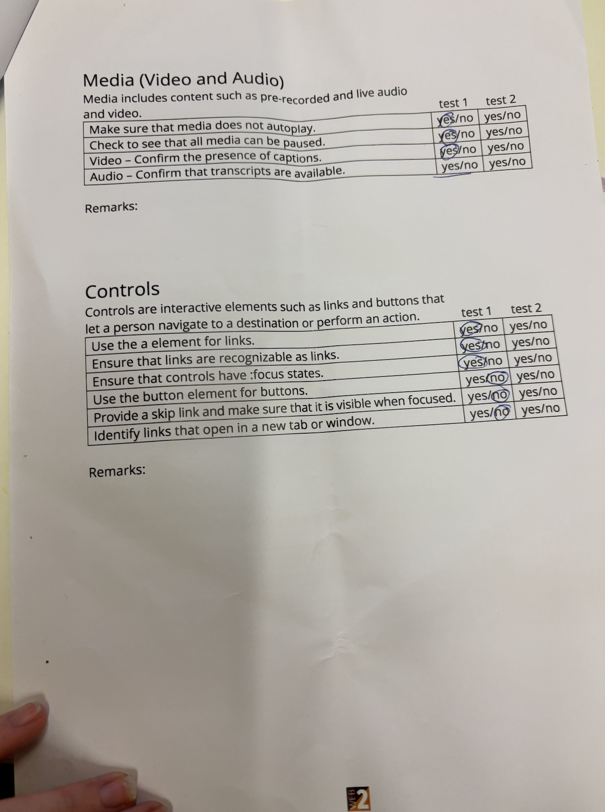
    

### Content

Eerst zijn we gaan kijken bij de Nintendo website hoe de content op de pagina er uitziet.
Er worden geen moeilijke woorden gebruikt maar vooral grafische afbeeldingen.
Als je kijkt naar de links,buttons en forms zijn ze goed beschreven en heeft een duidelijke uitles.

### Global code 
  
 Bij de validate code heben we gekeken naar de code van nintendo.
 Wat mij wel heel erg op viel is dat er veel onodige code in staat. En dat het heel erg opgesommed staat. 
 Het maakt geen gebruikt van lang attribute en heeft een duidelijke webpagina naam. Dus je kan het goed van elkaar onderscheiden.

 
  ### Bevindingen
  Lijst met je bevindingen die in de test naar voren kwamen:
Zoe (ik) en mijn test persoon 1 Anne hebben bij elkaar de toegangelijkheid test gedaan. 
Hier kwamen de volgende ondervindingen uit. 
Zoe: Die had eerst de website Disney webshop: https://www.disneystore.eu/
Bij deze website was de codereing taal zo niet goed ingesteld dat de toegangkelijkheid test niet goed uitgevoerd kon worden. 
Daarom heb ik er voor gekozen om nu voor de nintendo webshop te gaan

Link nintendo webshop:https://www.nintendo.com/nl-nl/?srsltid=AfmBOorMhTaZYZq0rxiyeK4VmXGpYTUFKA0n3r4hs2pjwHWJWLV1ToH7

Ane: die had voor de website Jellycat gekozen: https://eu.jellycat.com/?mtm_dummy=blank&utm_campaign=Search%20-%20DE%20-%20Brand%20%5BEU%5D%20-%20Core&mtm_cid=181165997975&utm_content=kwd-300724357885&mtm_kwd=jellycats&utm_source=google&utm_medium=cpc&mtm_group=search&mtm_placement=&gad_source=1&gad_campaignid=22670115757&gbraid=0AAAAADtxRQD5mRbj46LcsAltiscUEdLh1&gclid=EAIaIQobChMIhPSnl_TukAMVT6ODBx1nZhnJEAAYASAAEgLZIPD_BwE

Bij deze website ging de toegangelijkheid test best wel goed.
Wat ons wat opgevallen bij anne haar website was:

## Breakdownschets (week 1)

Nadat we de toegankelijkheid test hebben gedaan en onze website gekozen hebben wat voor mij dan de efteling website is. zijn we gaan kijken naar de breakdown schetsen.

Dit is heel belangerijk omdat je dan een hou vast heb naar de indeling van je webpagina. Ook is het belangerijk dat de opmaak van je HTML pagina goed in orde is voor dat je gaat beginnen aan het stylen daar van. 

  ### Mijn eerste breakdown schets van de hele pagina: 
  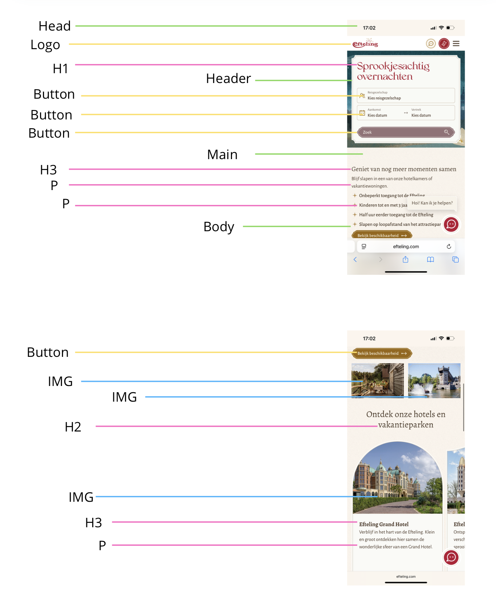
   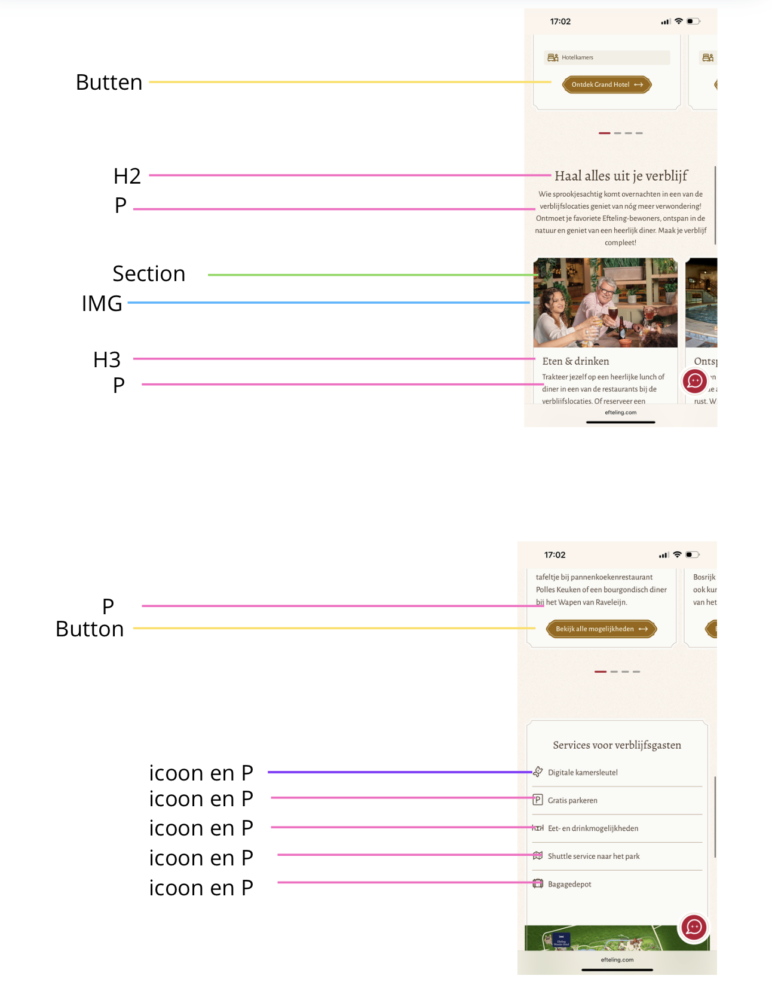
    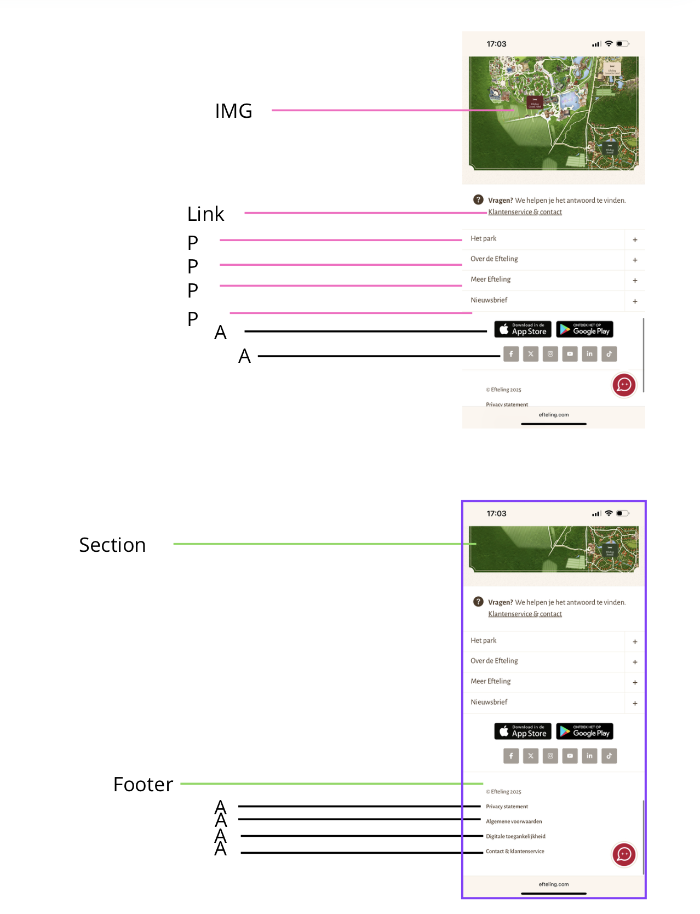

    Op de feedback van mijn eerste breakdown schetsen heb ik samen met de docent besproken en met een klas genoot (maud)

    Hier was de grooste feedback op omdat de indeling ziet er goed uit. Alleen let er op dat een breakdown schets voor jezelf is om een goed overzicht hebt.

  ### Mijn tweede breakdown schets van de hele pagina: 
  
  
  
  
  
  

Daarom heb ik even een nieuwe schets gemaakt. Deze heeft

  ### dynamisch deel (bijv menu): 
  

  ### wellicht nog een dynamisch deel (bijv filter): 
  

## Voortgang 1 (week 2)

  
uitwerken voor 1e voortgang

  ### Stand van zaken
  hier dit ging goed & dit was lastig (neem ook screenshots op van delen van je website en code)

  Dit ging goed in mijn code?
  De basis code van de efteling in mijn html te zetten ging er snel en goed.
    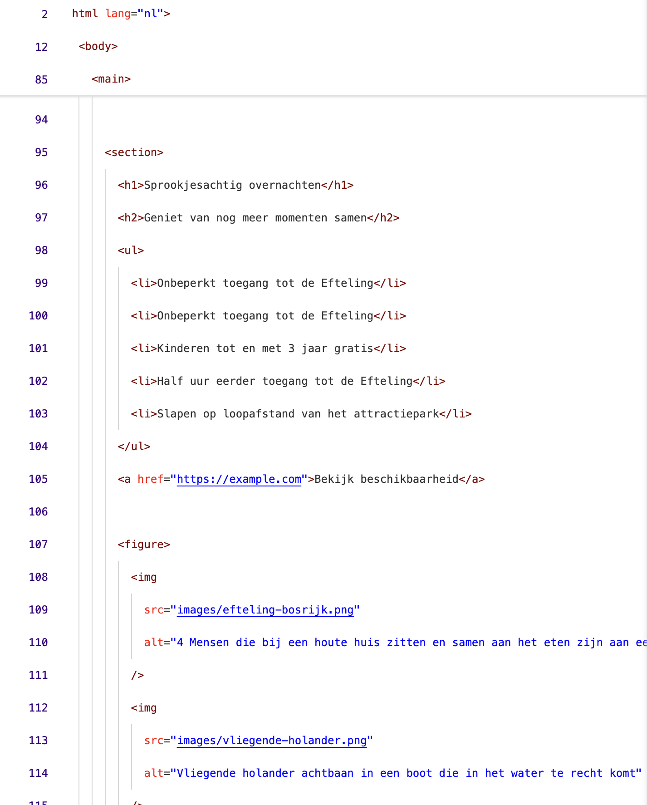
    Waarom dit zo goed ging is omdat ik heel snel de tekst er in kon zetten en de structuur van de opbouw. 

###
    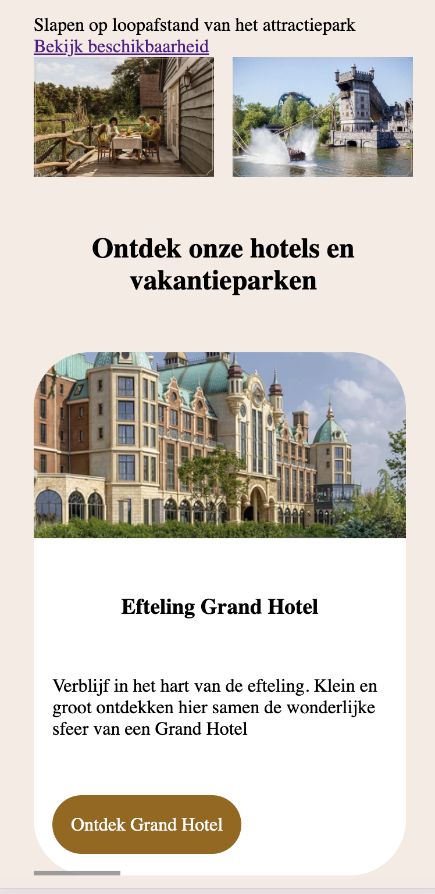

  ### Agenda voor meeting
  samen met je groepje opstellen
  Eerste gesprek ging ging samen met Vasilis zitten. 
  Bij het gesprek was alleen Maud en ik aanwezig. Hier lieten we onze basis code zien wat we allemaal al gemaakt hadden. 
  
  ### Het advies die ik heb gekregen 
  Bij mij was de basis code er goed in gezet alleen de indeling zelf klopte nog niet hellemaal. 
  Het is dus belangerijk dat je niet te snel gaat en eerst goed alles op de juiste volg order er in heb staan. 

  | Maud  
  Ik wil kijken naar een webiste die mij uitdaagt maar ook niet te moeilijk is om mee te beginen. Als ik meer tijd heb wil ik dieper op de stof in gaan en kleine extra dingen er in stoppen.

  | Cato  
  Ik wil graag veel gaan oefenen met de code en eerst de basis goed onder controle hebben. Voor de website die ik ga uitkiezen wil ik graag dat die me erg aanspreekt. Dat mocht ik meer tijd hebben er meer dingen aan kan toevoegen.

  | Zoe  
  Ik wil graag mij verder gaan ontwikkelen in codeer taal. 
  Dit ga ik doen door veel te gaan oefenen en echt te snappen hoe de toegangkelijkheid regels in elkaar zit. Als ik dan meer tijd over heb wil ik ga een stapje hoger gaan en kijken voor de rode piste.

  | Jip  
  Ik wil graag een simple website kiezen waarbij is rustig kan beginnen en zelf steeds meer dingen aan toevoegen. Wat ik heel graag zou gaan willen leren als ik extra tijd heb is dan die animaties.

  | Thijs
  Ik wil graag beter gaan worden in coderen. 
  Als ik meer tijd heb wil ik zelf gaan kijken naar betere toegankelijkheid.
 

  ### Verslag van meeting
  hier na afloop snel de uitkomsten van de meeting vastleggen

  - Hoe zet je de juiste indeling van je website neer  
  Hierbij hebben we besproken met ze alle hoe we het beste onze website kunnen ontleden. Bij sommige zit dat iets anders in elkaar dan bij andere. 
  Maar je hebt 1 H1 op elke website pagina ( Dat is meestal dan een titel)
  De H2 staat hoger dan de H3 

  - Hoe zet je code mooie en netjes neer
  Om het ook meer overzichtelijk voor jezelf om bij te houden. 

  - Controleer bij elkaar de toegankelijkheid van de website die je hebt gekozen
  Hou er rekening mee dat de website die je kiest juist niet perfect hoeft te zijn. 
  Je wilt juist op onderzoek gaan en als ontwerpen deze punten vinden en aanstreken.
  

## Voortgang 2 (week 3)

  
uitwerken voor 2e voortgang

  ### Stand van zaken
  hier dit ging goed & dit was lastig (neem ook screenshots op van delen van je website en code) 

  ### Agenda voor meeting
  samen met je groepje opstellen

  | Maud            
  
   | Cato    

   | Zoe  
   k heb gekozen gekozen voor de webiste efteling.
   Maar eerst had ik de disney website. En daarna wilde ik de ninetndo website doen. Maar ik heb die niet gekozen omdat ik die te ingewekkeld vodn kwa opbouw. 

   | Jip  
   Ik heb gekozen gekozen voor de webiste ESN  

   | Thijs
   Ik heb gekozen gekozen voor de webiste Knoppers
 

  ### Verslag van meeting
  hier na afloop snel de uitkomsten van de meeting vastleggen

  - punt 1
  - punt 2
  - nog een punt
- ...

## Toegankelijkheidstest 2/2 (week 4)

  
uitwerken na test in 9e werkgroep

  ### Bevindingen
  

## Voortgang 3 (week 4)

  
uitwerken voor 3e voortgang

  ### Stand van zaken
  hier dit ging goed & dit was lastig (neem ook screenshots op van delen van je website en code)

  ### Agenda voor meeting
  samen met je groepje opstellen

  | Maud      
  
  | Cato          
  
  | Zoe    
  
  | Jip       
  
  | Thijs

  ### Verslag van meeting
  hier na afloop snel de uitkomsten van de meeting vastleggen

  - punt 1
  - punt 2
  - nog een punt
  - ...

## Eindgesprek (week 5)

  
uitwerken voor eindgesprek

  ### Je uitkomst - karakteristiek screenshots:
  

  ### Dit ging goed/Heb ik geleerd: 
  Korte omschrijving met plaatjes

  

  ### Dit was lastig/Is niet gelukt:
  Korte omschrijving met plaatjes

  

Toegangkelijkheid test

## Bronnenlijst

  
continu bijhouden terwijl je werkt

  Nb. Wees specifiek ('css-tricks' als bron is bijv. niet specifiek genoeg). 
  Nb. ChatGpT en andere AI horen er ook bij.
  Nb. Vermeld de bronnen ook in je code.

  1. https://developer.mozilla.org/en-US/docs/Web/CSS/Reference/Properties/grid-column
  2. https://developer.mozilla.org/en-US/docs/Web/CSS/Reference/Properties/grid-auto-rows
  3. https://developer.mozilla.org/en-US/docs/Web/CSS/Reference/Properties/grid-auto-rows
  4. https://www.accessibility.nl/kennis/zo-zet-je-skiplinks-voor-een-optimale-navigatie
  5. https://dlo.mijnhva.nl/content/enforced/690110-FDMCI-CRS-00042507/FED%2025-26%20-%20Blok%202%20-%20Oefening%20typografie%20-%201%20letters.pdf
  6. 

  
  

   

   