# Procesverslag intro

deze 5 weken ben ik hard aan het werk gegegaan. 
Ik moet eerlijk zeggen ik vond dit heel lastig. 
Zelf heb ik hier een hoop uren aan besteed alleen waar ik het groost tegen aan liep is dat ik nog niet goed eerst de basis code snapte. Dit koste mij ongeveer twee tot drie weken om dit echt bij te werken. 

Ik heb tijdens deze 5 weken hulp uitleg gehad gehad van de volgende mensen:

De docent,
Ali, Ronald en de  
studenten assistenten ( als iemand mij heeft geholpen dan zie je daar ook een comment bij)
School oefeningen
hulp bronnen ( die je onder aan de pagina kan vinden bij de bronnen lijst )

## Jij

Ik zelf ben een persoon die heeft veel moeite heeft met code. 

  ### Auteur:
  

  Zoe Ros 

  #### Je startniveau:
  

 Blauw

  #### Je focus:
  

  surface plane

  Ik had eerst responsive gekozen, maar al snel kwam ik er achter dat de vormaten op al de drie te schermen iets te lastig voor me was dus ik ben in de eerste week geswitch nar surface plane. 

  Met surface plane werk je met animaties. 
 

## Je website

 

  ### Je opdracht:
  

Voor de opdracht gingen we twee pagina nameken van een webiste naar keuzen. Ik had eerst voor de disney website gekozen. Maar later kwam ik er achter dat deze pagina niet goed bij me paste en toen ben ik naar de nintendo website gegegaan. 

Zelf na onderzoek te doen naar de nintendo webiste ben ik er achter gekemen dat ik deze website erg lastig vond en toch niet goed bij mijn niveau vond passen.

Dus ben ik gaan kijken naar de efteling webiste omdat ik zelf erg fan ben van de efteling. 

### Pagina 1 Efteling 

Voor mijn eerste pagina wil ik graag de overnachting pagina doen.
  https://www.efteling.com/nl/overnachten

### Pagina 2 Efteling

  Voor mijn tweede pagina wil ik graag de pagina van de winter efteling gaan doen.
  https://www.efteling.com/nl/park/events/winter-efteling
  

  #### Screenshot(s) van de eerste pagina (small screen): 
  

 
  
  
  
  

  Op deze pagina kan je kijken naar een efteling overnachting.
  Ook zie je de verschillende hotels waar je kan overnachten
  En waar je heerlijk kan ontspannen en kan gaan eten en drinken.
  Daarna kan je de efteling kaart vinden.

  #### Screenshot(s) van de tweede pagina (small screen):
  

  
  
  
  
  

Bij de tweede twee pagina wordt je voor bereid op een prachtige winter efteling. Ook vind je de voordelen van naar de winter efteling gaan. En waarom het zp leuk is om tijdens de kerst te blijven slapen.

 

## Toegankelijkheidstest 1/2 (week 1)

Voorwoord: We gaan onderzoek doen en meer leren over de wetregeling van de WCAG check. 
Deze regeling is heel erg belangerijk omdat het een geaccepteerd standaard is voor toegankelijkheid voor websites.

### eerste toegankelijkheidtest Nintendo

 
  
   
    
    

### Content

Eerst zijn we gaan kijken bij de Nintendo website hoe de content op de pagina er uitziet.
Er worden geen moeilijke woorden gebruikt maar vooral grafische afbeeldingen.
Als je kijkt naar de links,buttons en forms zijn ze goed beschreven en heeft een duidelijke uitles.

### Global code 

  
 Bij de validate code heben we gekeken naar de code van nintendo.
 Wat mij wel heel erg op viel is dat er veel onodige code in staat. En dat het heel erg opgesommed staat. 
 Het maakt geen gebruikt van lang attribute en heeft een duidelijke webpagina naam. Dus je kan het goed van elkaar onderscheiden.

Omdat ik niet toch voor de nintendo webiste ben gegaan heb ik de wcag test nog een keer gedaan maar dan bij de efteling website. 

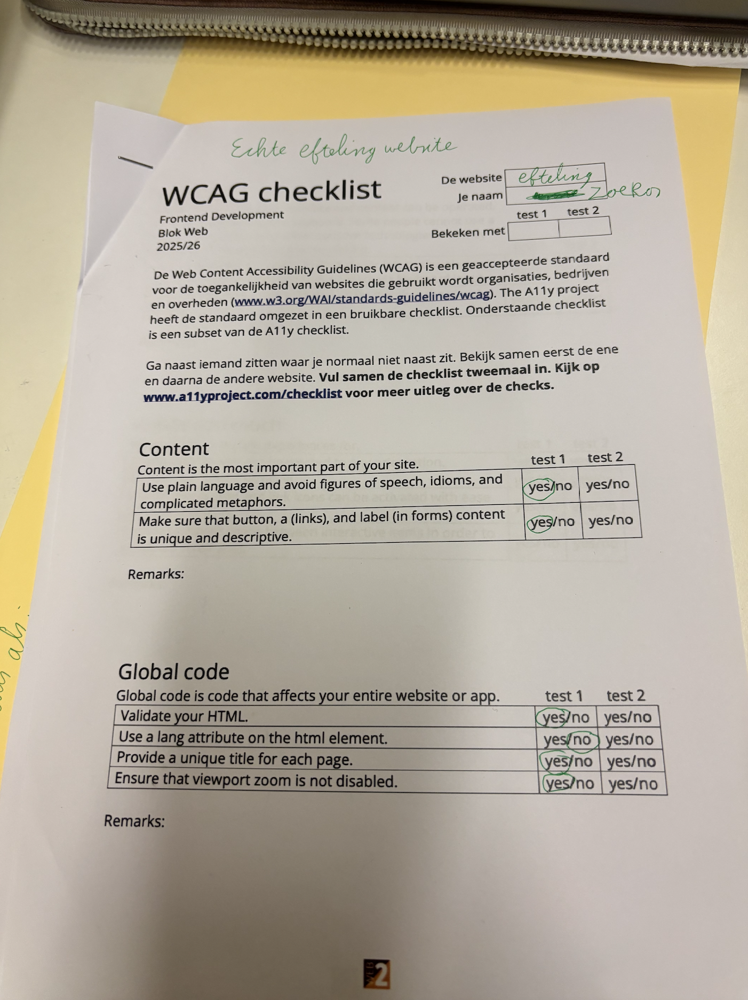
 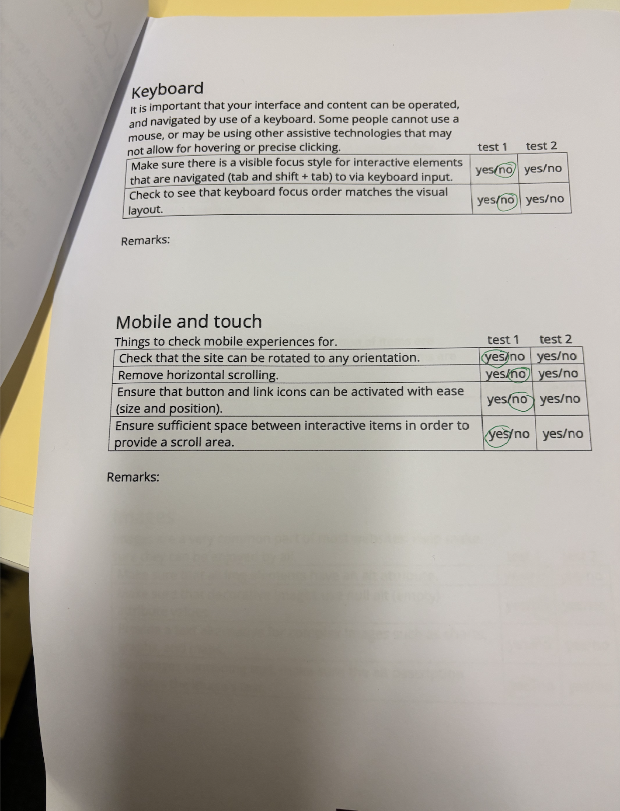
 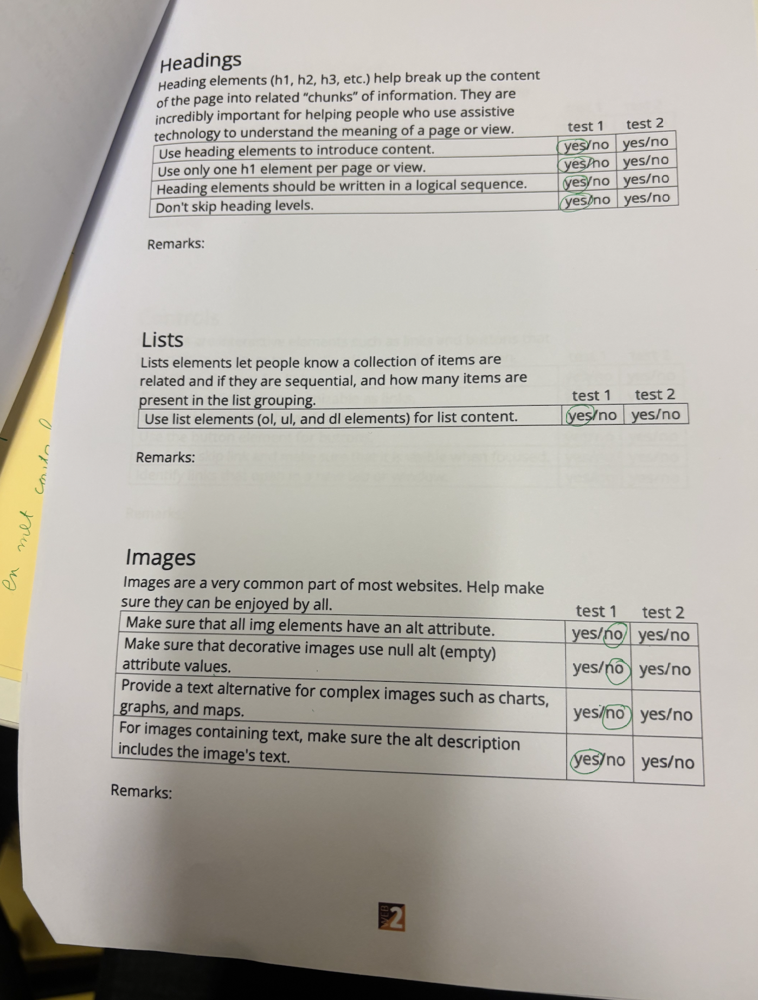
 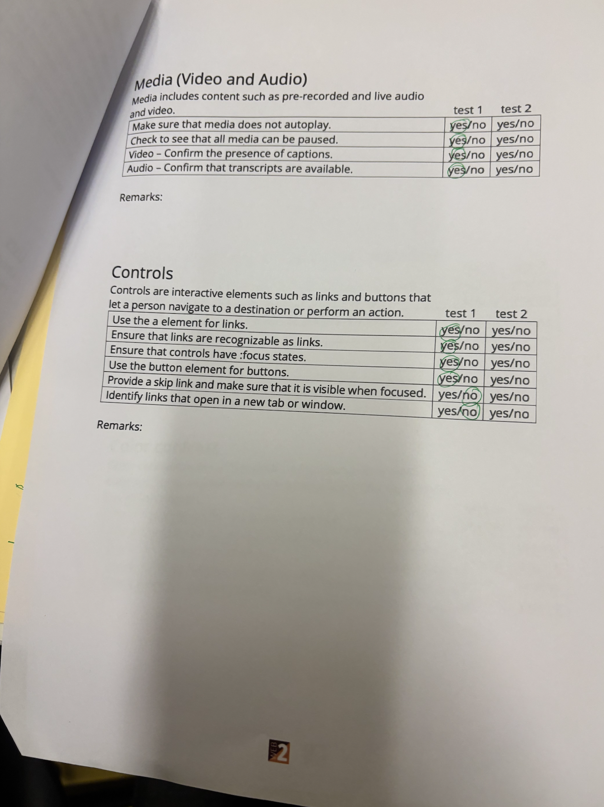
 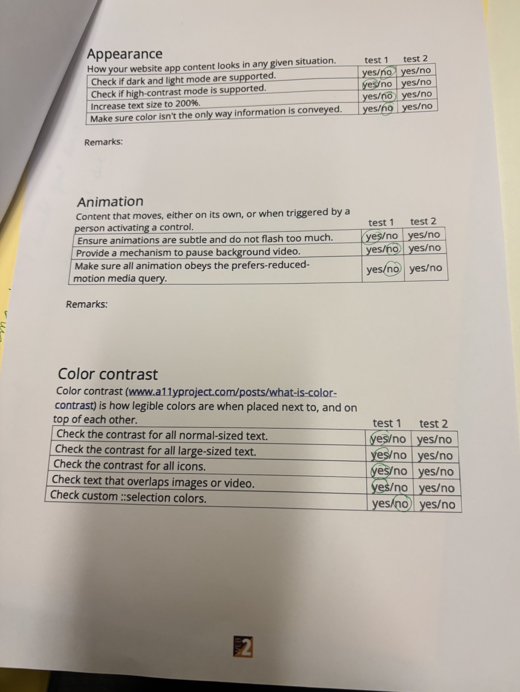

  ### Bevindingen
  

  Lijst met je bevindingen die in de test naar voren kwamen:
Zoe (ik) en mijn test persoon 1 Anne hebben bij elkaar de toegangelijkheid test gedaan. 
Hier kwamen de volgende ondervindingen uit. 
Zoe: Die had eerst de website Disney webshop: https://www.disneystore.eu/
Bij deze website was de codereing taal zo niet goed ingesteld dat de toegangkelijkheid test niet goed uitgevoerd kon worden. 
Daarom heb ik er voor gekozen om nu voor de nintendo webshop te gaan

Link nintendo webshop:https://www.nintendo.com/nl-nl/?srsltid=AfmBOorMhTaZYZq0rxiyeK4VmXGpYTUFKA0n3r4hs2pjwHWJWLV1ToH7

Ane: die had voor de website Jellycat gekozen: https://eu.jellycat.com/?mtm_dummy=blank&utm_campaign=Search%20-%20DE%20-%20Brand%20%5BEU%5D%20-%20Core&mtm_cid=181165997975&utm_content=kwd-300724357885&mtm_kwd=jellycats&utm_source=google&utm_medium=cpc&mtm_group=search&mtm_placement=&gad_source=1&gad_campaignid=22670115757&gbraid=0AAAAADtxRQD5mRbj46LcsAltiscUEdLh1&gclid=EAIaIQobChMIhPSnl_TukAMVT6ODBx1nZhnJEAAYASAAEgLZIPD_BwE

Bij deze website ging de toegangelijkheid test best wel goed.
Wat ons wat opgevallen bij anne haar website was:

is bij haar dat er meer openheid was naar toegangkelijkheid maar dat de website er zelf ook druk uitzag kwa ontwerp.

### Nieuwe bevindendingen efteling website

Bij de efteling website verrassend genoeg was er geen werkte de tap en de sprak functie heel erg slecht dit is iets voor mijn efteling website wat ik zeker weten wil gaan verbeteren.

## Breakdownschets (week 1)

Nadat we de toegankelijkheid test hebben gedaan en onze website gekozen hebben wat voor mij dan de efteling website is. zijn we gaan kijken naar de breakdown schetsen.

Dit is heel belangerijk omdat je dan een hou vast heb naar de indeling van je webpagina. Ook is het belangerijk dat de opmaak van je HTML pagina goed in orde is voor dat je gaat beginnen aan het stylen daar van. 

  ### Mijn eerste breakdown schets van de hele pagina: 
  

  
   
    

    Op de feedback van mijn eerste breakdown schetsen heb ik samen met de docent besproken en met een klas genoot (maud)

    Hier was de grooste feedback op omdat de indeling ziet er goed uit. Alleen let er op dat een breakdown schets voor jezelf is om een goed overzicht hebt.

  ### Mijn tweede breakdown schets van de hele pagina: 
  

  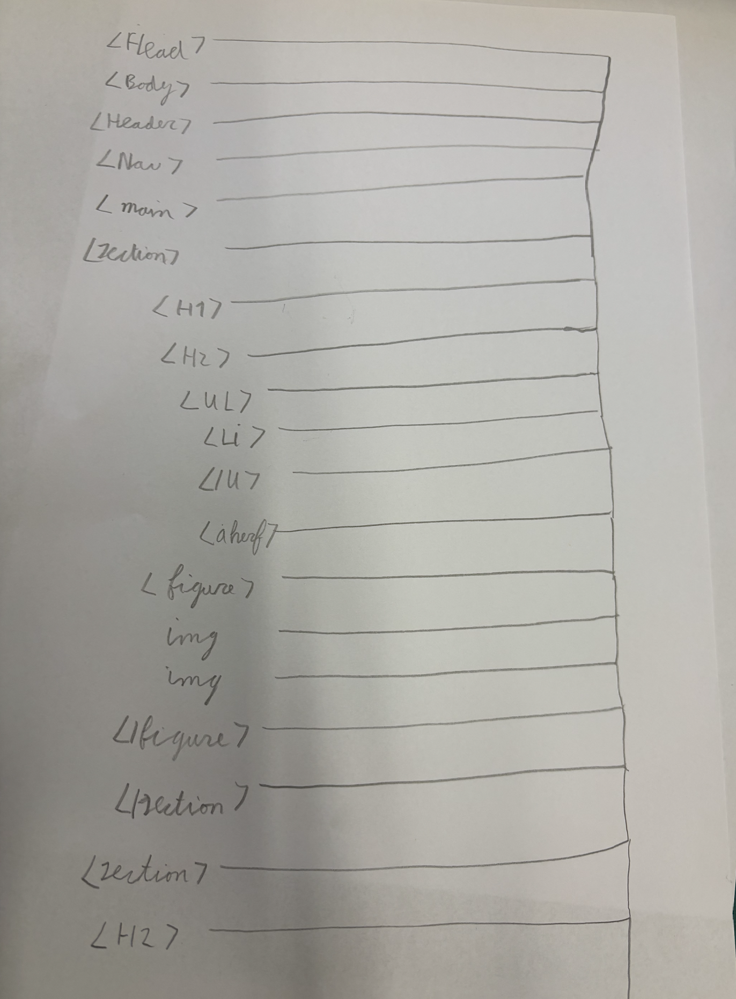
  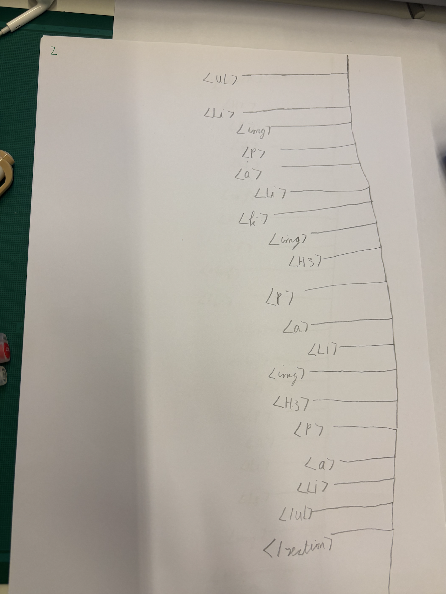
  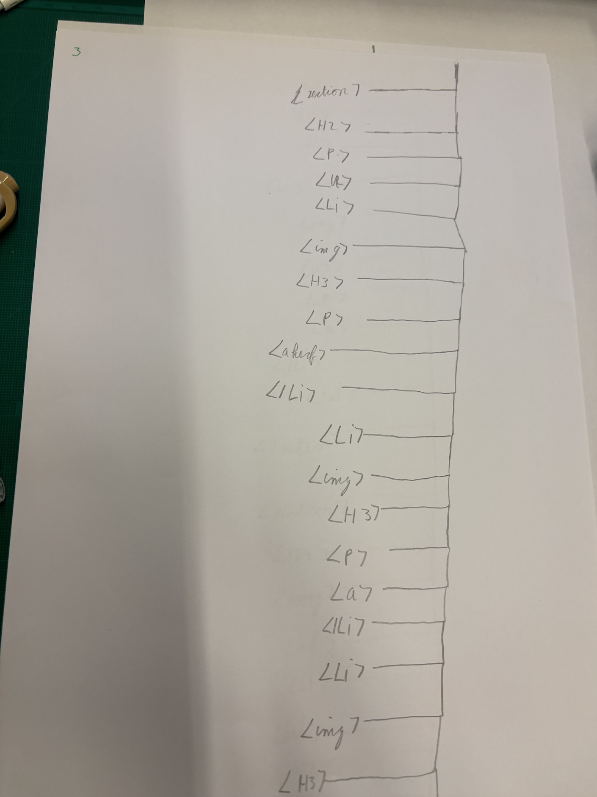
  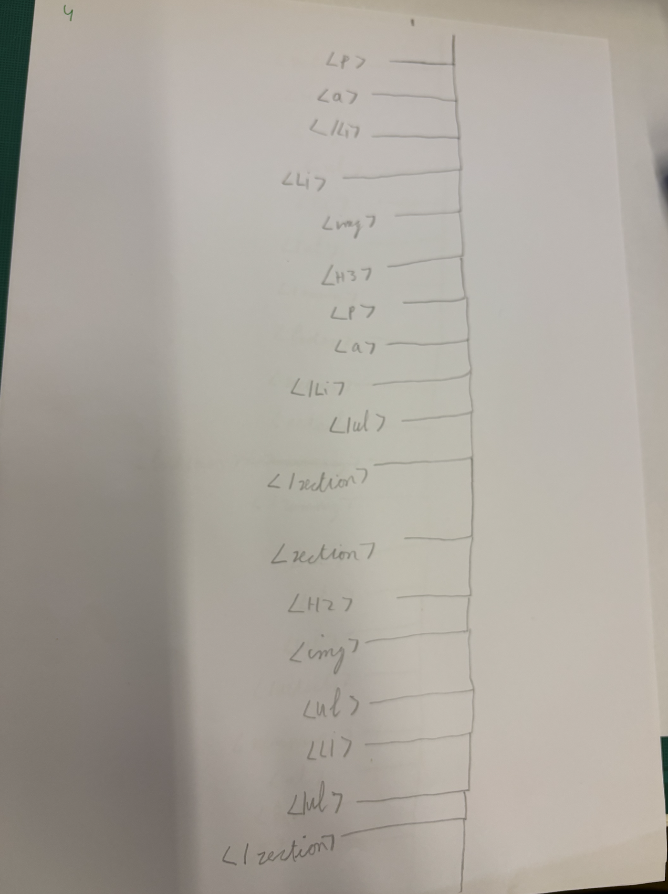
  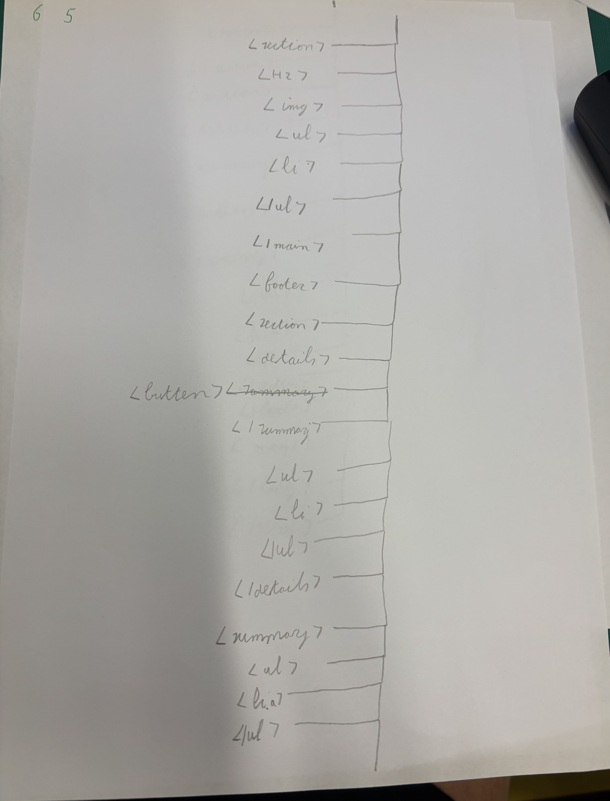
  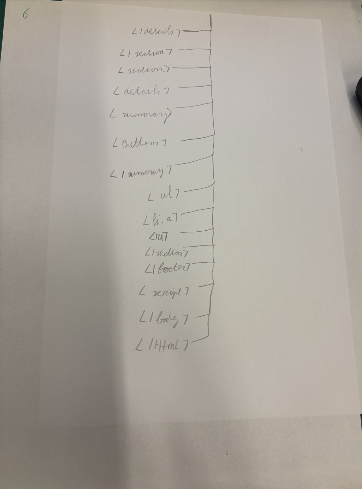

Daarom heb ik even een nieuwe schets gemaakt. Deze heeft wel de hele uitgewerkt en op geschreven hoe ik precies de indeling wil hebben. 

  ### dynamisch deel (bijv menu): 
  

  Het menu is in en uitklap maar en kan je niet door heen tappen maar bij mijn ontwerp die ik ga maken kan dat wil en is het meer gebruiks vriendlijk 

  voor de rest ziet het menu er rustig uit en kan je makkelijk de navigatie er door heen volgen.

  ### wellicht nog een dynamisch deel (bijv filter): 
  

  Er zit niet echt een filter in de webiste van de efteling de engine filter die er echt een beetje in zit gaat over met de tickets.

## Voortgang 1 (week 2)

  ### Stand van zaken
  

  In week twee ging ik beginnen met de html code schrijven en was ik nog niet echt bezig op de stijling er van. Omdat ik zo snel de html basis er in heb kunnen zetten ben ik einde van de week een beetje begonnen met de css.

   

       Alles in de HTML zetten ging goed zo als je hier boven kan zien. 
       Dit was echt binnen een paar uur gemaakt. Wel merkte ik later dat ik nog een paar dingen moest aanpassen. Hierdoor moest ik ook nog een keer het structuur door nemen. En steeds verbeterde ik het zo dat de code goed zou gaan blijven werken. 

 
 ### Wat ging er lastig? 
 

 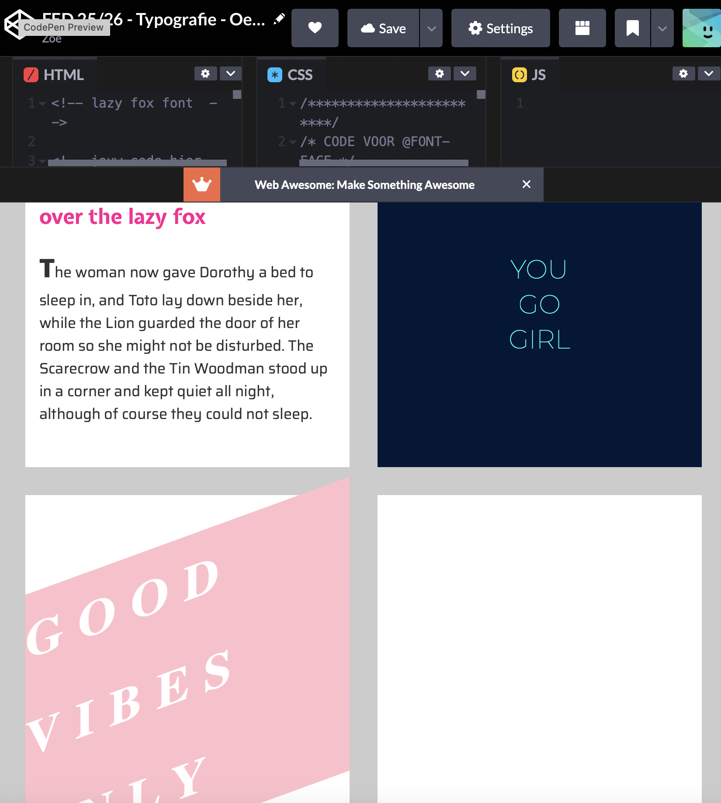

 Een van de eerste opdrachten die ik heb gedaan ging over oefen met typografie en tekst. Zoals ik al had aangegeven voor dat ik uberhoud begon had ik al moeite met de basis code.

 Ik heb voor de efteling website de font opgezocht en toen instaleerd.
 https://fonts.google.com/specimen/Alegreya

 ondanks dit best makkelijk is merkte ik dat ik vooral tegen de simple dingen aanliep maar nu wel snap. 

  ### Agenda voor meeting
  

  samen met je groepje opstellen
  Eerste gesprek ging ging samen met Vasilis zitten. 
  Bij het gesprek was alleen Maud en ik aanwezig. Hier lieten we onze basis code zien wat we allemaal al gemaakt hadden. 
  
  ### Het advies die ik heb gekregen 
  

  Bij mij was de basis code er goed in gezet alleen de indeling zelf klopte nog niet hellemaal. 
  Het is dus belangerijk dat je niet te snel gaat en eerst goed alles op de juiste volg order er in heb staan. 

  | Maud  
  Ik wil kijken naar een webiste die mij uitdaagt maar ook niet te moeilijk is om mee te beginen. Als ik meer tijd heb wil ik dieper op de stof in gaan en kleine extra dingen er in stoppen.

  | Cato  
  Ik wil graag veel gaan oefenen met de code en eerst de basis goed onder controle hebben. Voor de website die ik ga uitkiezen wil ik graag dat die me erg aanspreekt. Dat mocht ik meer tijd hebben er meer dingen aan kan toevoegen.

  | Zoe  
  Ik wil graag mij verder gaan ontwikkelen in codeer taal. 
  Dit ga ik doen door veel te gaan oefenen en echt te snappen hoe de toegangkelijkheid regels in elkaar zit. Als ik dan meer tijd over heb wil ik ga een stapje hoger gaan en kijken voor de rode piste.

  | Jip  
  Ik wil graag een simple website kiezen waarbij is rustig kan beginnen en zelf steeds meer dingen aan toevoegen. Wat ik heel graag zou gaan willen leren als ik extra tijd heb is dan die animaties.

  | Thijs
  Ik wil graag beter gaan worden in coderen. 
  Als ik meer tijd heb wil ik zelf gaan kijken naar betere toegankelijkheid.
 

  ### Verslag van meeting
  

  hier na afloop snel de uitkomsten van de meeting vastleggen

  - Hoe zet je de juiste indeling van je website neer  
  Hierbij hebben we besproken met ze alle hoe we het beste onze website kunnen ontleden. Bij sommige zit dat iets anders in elkaar dan bij andere. 
  Maar je hebt 1 H1 op elke website pagina ( Dat is meestal dan een titel)
  De H2 staat hoger dan de H3 

  - Hoe zet je code mooie en netjes neer
  Om het ook meer overzichtelijk voor jezelf om bij te houden. 

  - Controleer bij elkaar de toegankelijkheid van de website die je hebt gekozen
  Hou er rekening mee dat de website die je kiest juist niet perfect hoeft te zijn. 
  Je wilt juist op onderzoek gaan en als ontwerpen deze punten vinden en aanstreken.
  

## Voortgang 2 (week 3)

  
### Stand van zaken
### Wat ging er goed?

Wat heel erg goed ging was de foto's er in zetten. En met nth werken. 
Ik zelf vond het eerst heel lastig om daar mee te werken maar kreeg al snel door dat het heel handig is als je iets appart wil aanspreken in je HTML.

Ik heb bijvoorbeeld 5 section in mijn eerste webpagina dus dan spreek je zo aan met 

main section:nth-of-type(1) 
alles wat dus in de main staat als een section speek je aan bijdeze dus nu de eerste section.

Als je dan bijvoobeeld specifier wilt dan zeg je:main section:nth-of-type(2) li h3 

let wel op hoe de indeling van je section:nth is want als je hem niet goed aanspreekt werkt die niet meer.

### Wat ging er slecht?

 Wat ik heel lastig vond was grid. Hier heb ik uitleg gehad van ronald en ali. Die hebben het voor mij uitgetekt zodat ik zelf de code kan gaan schrijven. 

  
   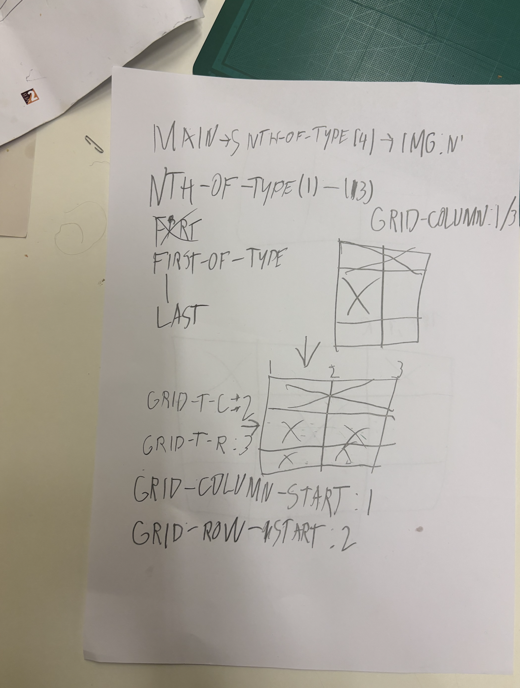
    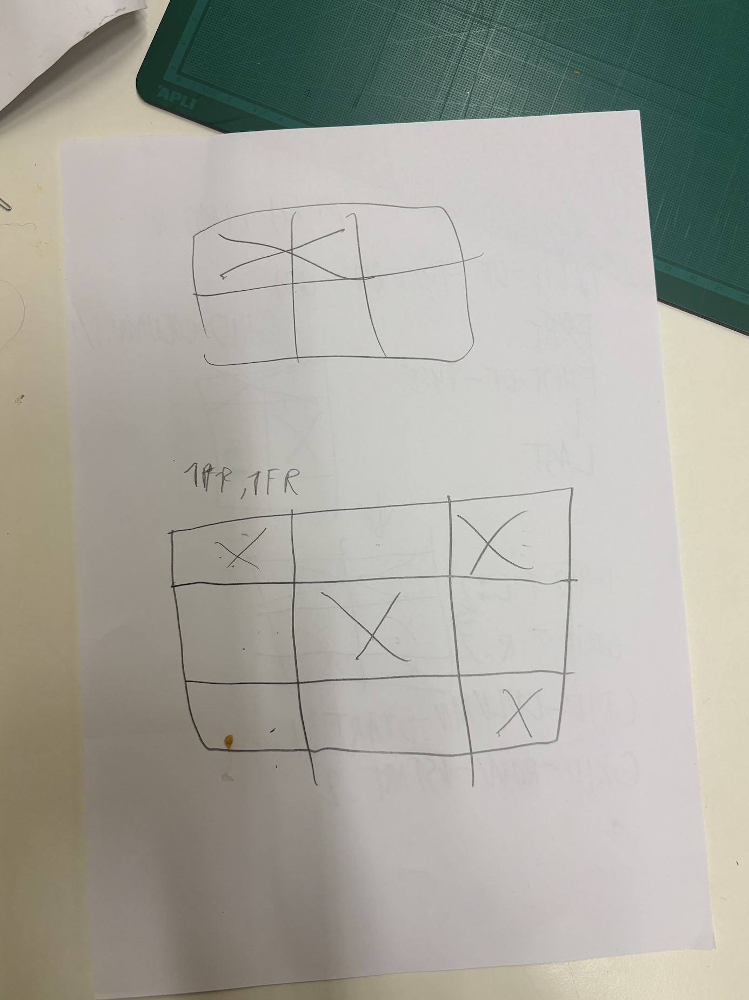
     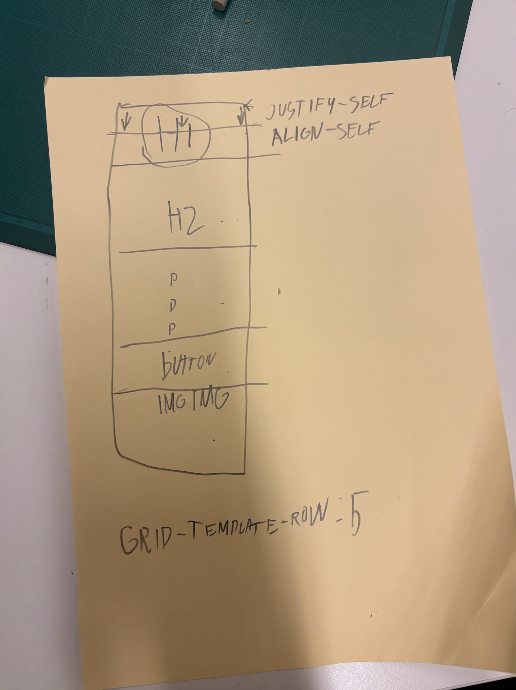
     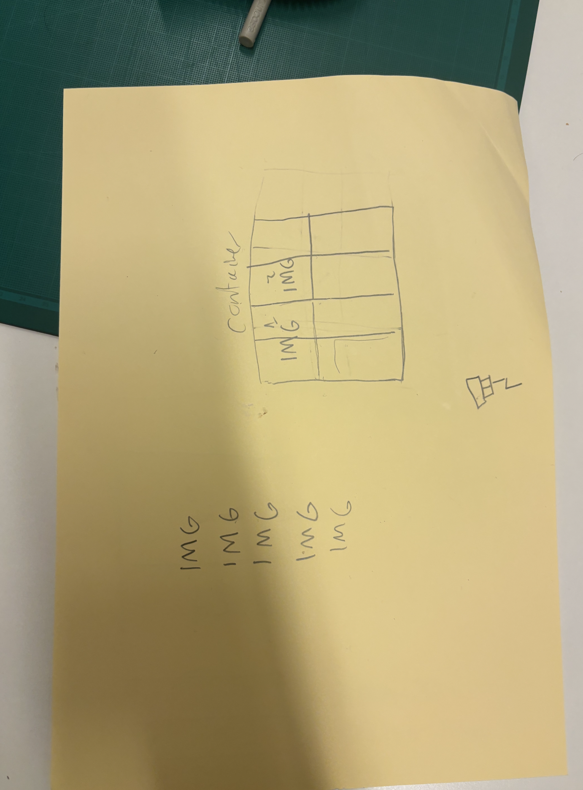

Hierboven zie je een paar schetsen waarin de uitleg te zien is
Na dat de uitleg is gegeven en ik ben gaan kijken naar de oefeningen bij codepen. Ben ik het daarna zelf gaan proberen om te kijken hoe het bij mij website gaat werken.

 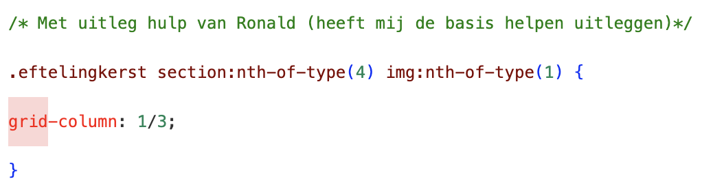
  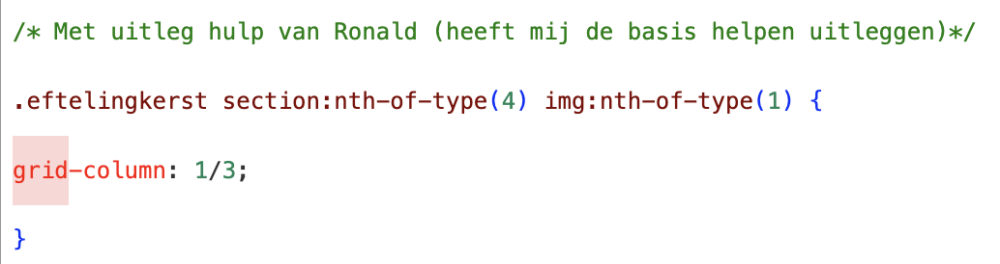
   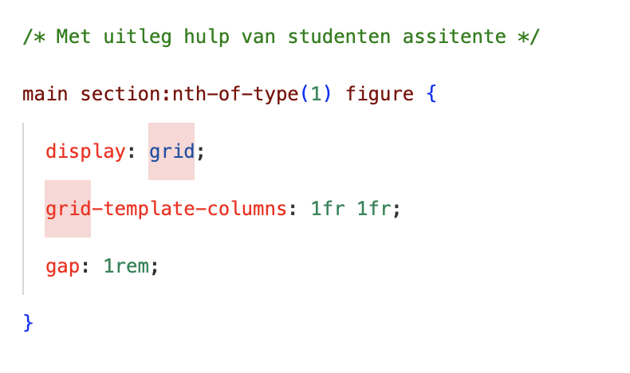
    
     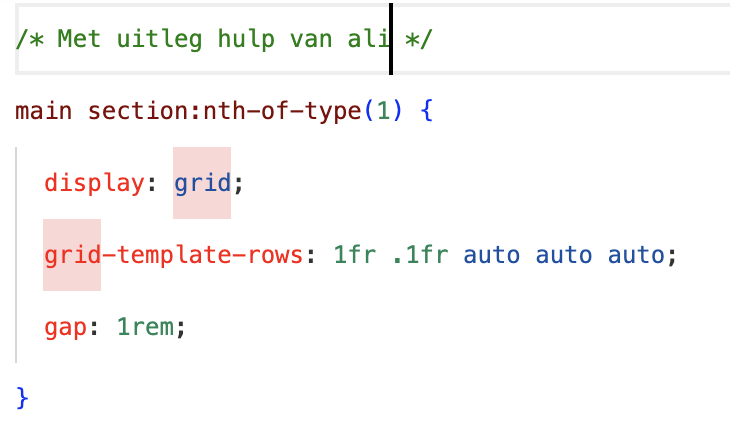

     Ik heb grid gebruikt bij de eerste pagina in de eerste section
     ik wilde graag de foto's naast elkaar hebben en zorgen dat alles op de juiste plek staat. 

     De foto's staan in een figure en ik heb gezegt dat het nu  grid-template-columns: 1fr 1fr;  dus de eerste foto staat op 1 en 2 en de tweede foto staat op 2 en 3 

     ik heb een gab op de eerste section dit zorgt ook voor wit ruimte in de grid tussen de knop en de teksten.

     ook staat er grid bij de tweede pagina bij section 4.
     Deze heb ik gebruikt om een collem te maken om de foto's onder elkaar neer te zetten zoals ook op de webiste staat.  

  
  ### Agenda voor meeting
  

  Samen met ons groepje gingen we samen zitten en bespreken hoe ver we nu zijn. Daar was in uitgekomen dat we allemaal wel de basis in onze HTML hebben staan. Toen hebben we gekeken allemaal naar onze CSS om te kijken waar we elkaar kunnen gaan helpen

  | Maud  
  Had moeite om alles goed op de juiste plek te zetten bij haar website. Daarom pas het belangerijk om nog een keer even te kijken naar de grid en positie lessen.         
  
   | Cato    
   Was nog niet heel erg ver maar kon wel mee kijken naar de rest. Vond zelf de oefeningen maken niet heel lastig. Toevallig was dat ook de week van positioneren en states. En ook zoe had daar zeld moeite mee dus deelde we hoe we het zouden aanpakken.

   | Zoe  
   ik wilde graag gaan leren hoe je een carosel kan maken zodat je de afbeeldingen kan rond bewegen met je muis. In section 3 heb ik een flex en scroll neer gezet. Deze informatie komt uit les twee, dit hielp Jip en Thijs ook verder. 

   | Jip  
   Jip gaf aan dat alles goed bij haar ging en dat ze graag voor nu voornamelijk met ons wil gaan meekijken. En dat als ze vragen heeft dat ze dat dan laat weten. Voor nu moet ze nog veel oefenen met de opdrachten en kijken wat ze graag in haar website wil gaan stoppen en hoe ze dat goed moet gaan doen met CSS.

   | Thijs
   Thijs gaf aan dat die coderen niet heel makkelijk vind maar dat alles wel oke gaat maar dat die er nog hard mee bezig is. En voor nu voornamelijk bezig is om alles in de twee pagina te zetten en hoe je het goed moet gaan stylen.
 

  ### Verslag van meeting
  

  hier na afloop snel de uitkomsten van de meeting vastleggen

  - Hoe werkt een Flexbox ook al weer
  - Hoe hou je er rekening mee dat je eigen website ook goed toegankelijk word
  - Hoe werkt States
  - Wat moet er in je JS code staan 
  - Grid nog even door bespreken

## Toegankelijkheidstest 2/2 (week 4)

In week 4 zijn we bezig geweest onze eigen website te checken op toegankelijheid. Hierbij gaan we kijken naar de verschillen hoe het eerst was. En hoe veel beter het nu is geworden.

### Toegangkelijkheid test van mijn eigen efteling webiste
  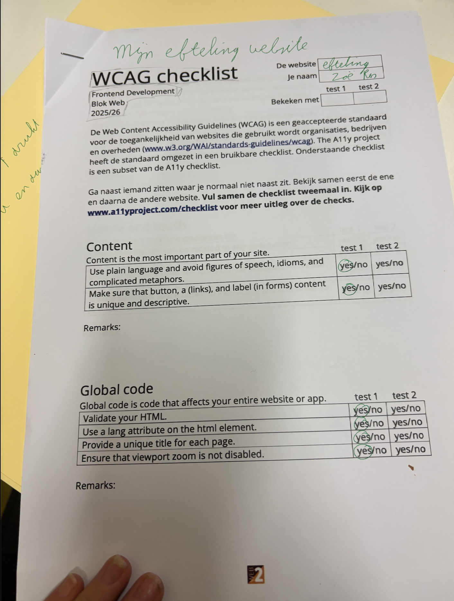

   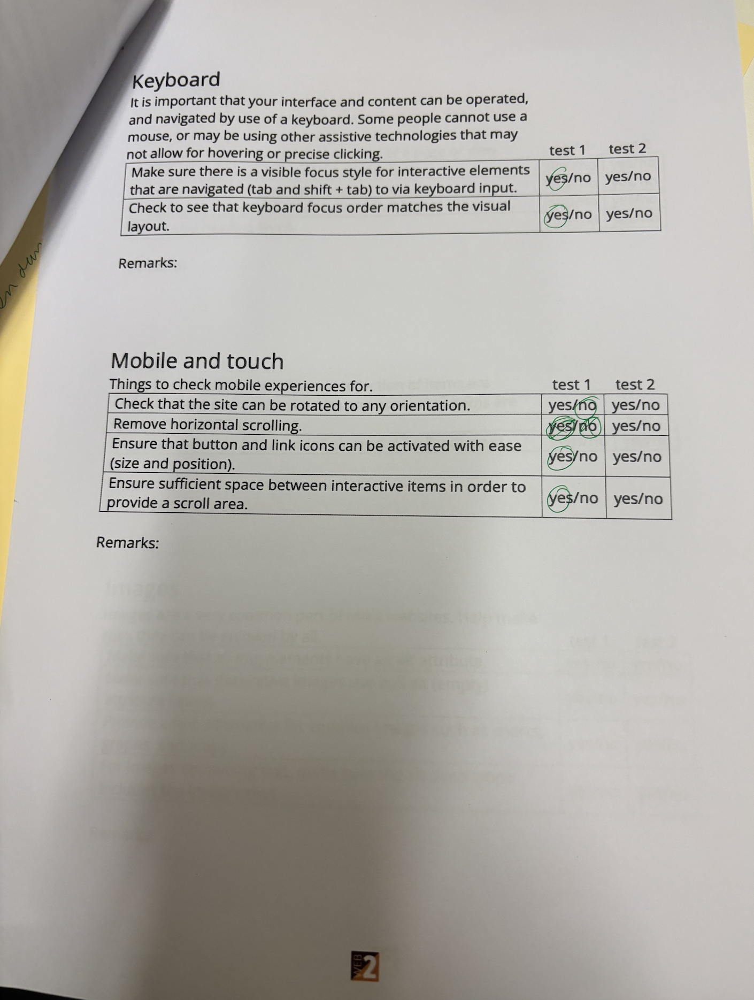

   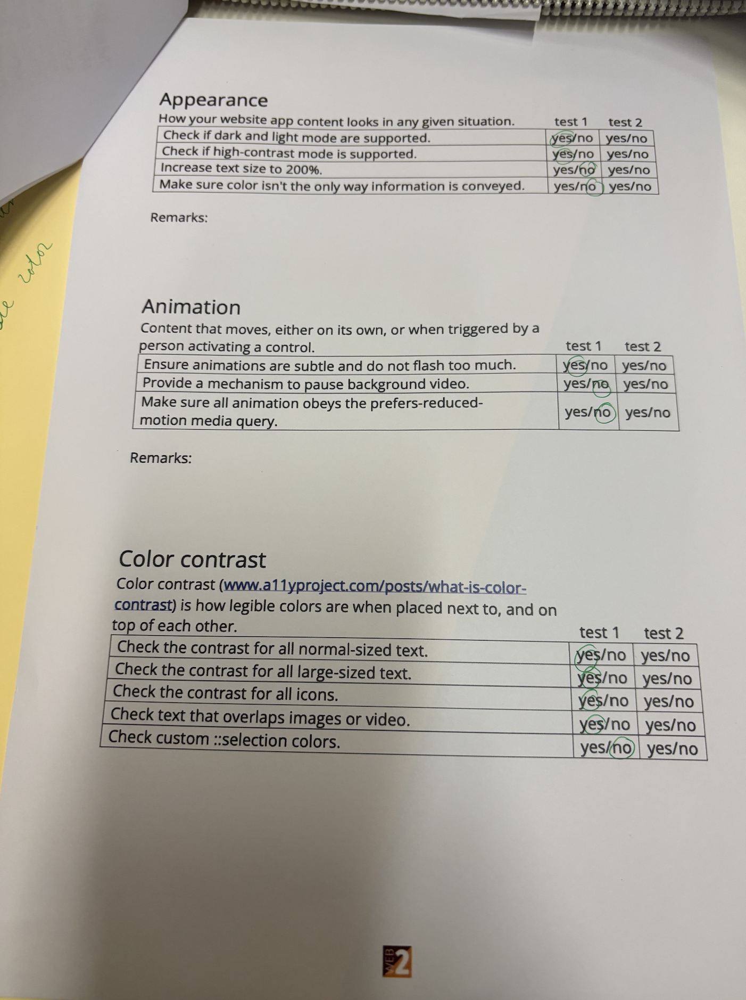

 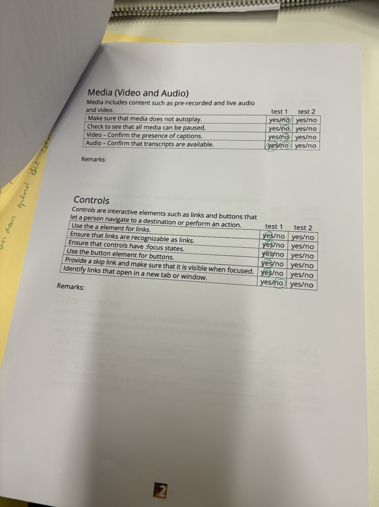

  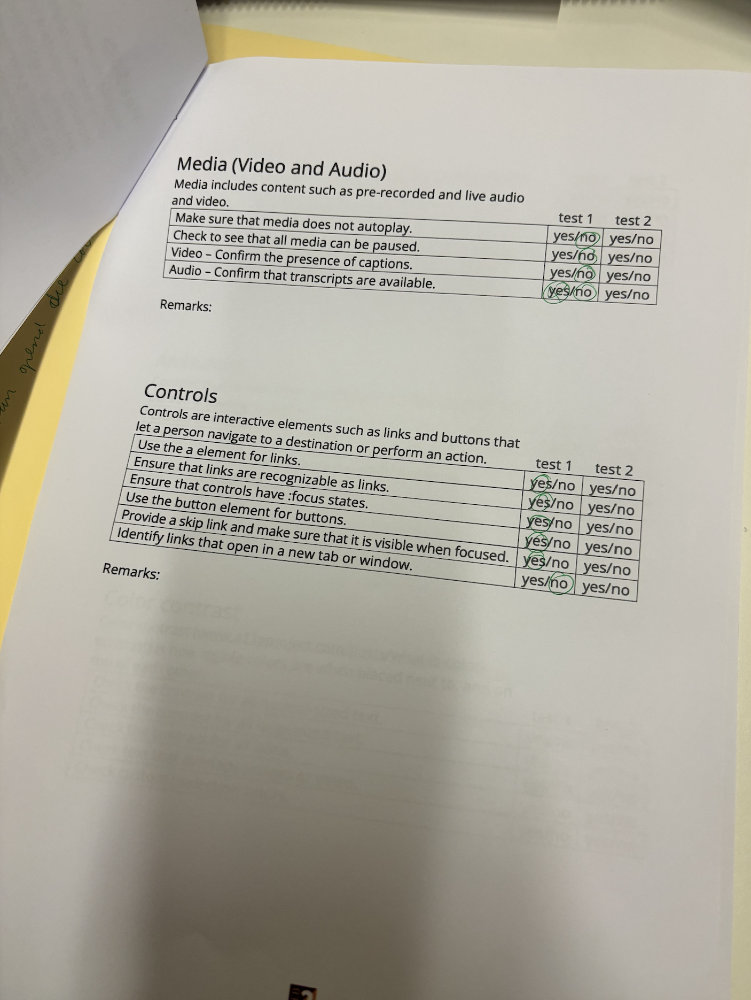

### Wat hebben we aangepast?

Wat ik dus nu heb aangepast met de wcag checklist is dat je dus nu wel kan tappen door de website en dat die dus nu ook beter voorleest van de beschrijvingen van een link zodat er niet alleen maar staat meer informatie maar dus ook waar je dus meer informatie over krijgt.

Ook heb ik veranderd dat als je over een link gaat dat het goed te zien is niet alleen bij de buttons maar ook bij de footer.

### Wat is het zelfde gebleven?

Wat het zelfde is gebleven is dat als je over de buttons gaat dat je een hover ziet.

Wat ook het zelfde is gebleven is dat de teskt niet al te moeilijk is en dat het goed te volgen is. 

En dat alle buttons aan de juiste kant zitten. De elementen zitten nu ook nog steeds op de juiste plek. En het contrast van de elemensten zijn ook het zelfde gebleven.

  ### Bevindingen
  Mijn bevindingen hier uit zijn gekomen dat de website zeker niet bevoegd was voor mensen die niet goed konden zien. Dus als ze door de website wilde tappen dan was dat niet echt mogelijk wat me best wel verbaste. 

  Ook ben ik er achter gekomen dat door regels aan te houden van de wcag checklist dat je website er meer in orde er uitziet niet persee aan de buiten kant maar vooral aan binnenkant van je code.
  

## Voortgang 3 (week 4)

  

  ### Stand van zaken
  ### Wat ging er goed?
  Wat ik aan het einde heel goed vond gaan is alle aria-label aanspreken en zorgen dat er een duidelijke tekst staat. 

  Het was wel even zoeken hoe en wat en veel oefenen met de werking er van maar alles daar van is nu gelukt.

  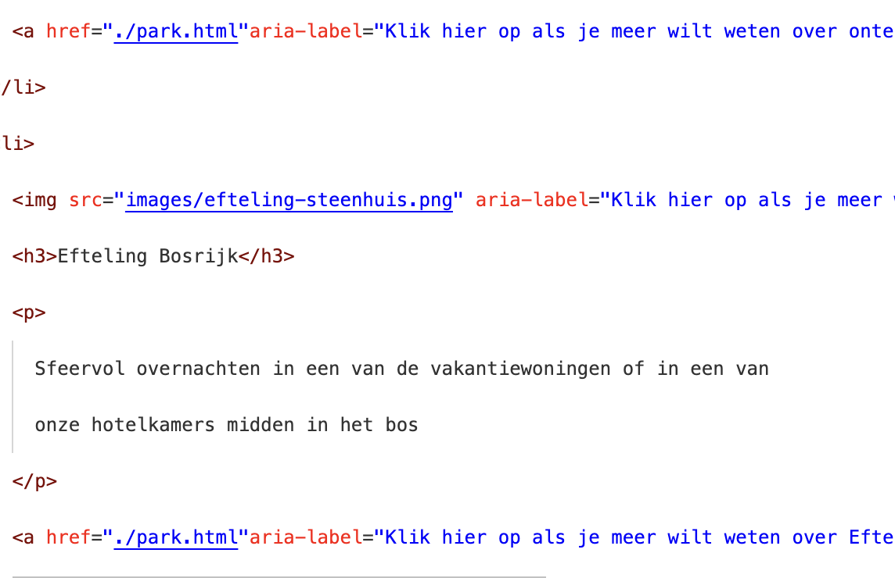

  ### Wat ging er slecht?
Wat er minder goed ging is:
  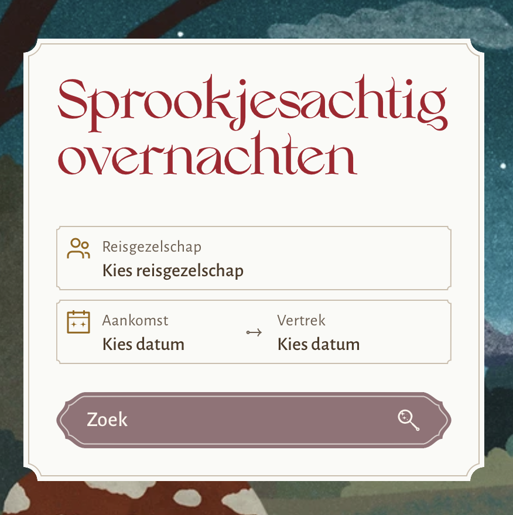

  Ik wilde graag wat je hier boven ziet namaken. Maar dat is me uiteindelijk niet gelukt omdat het te hoog voor mij gegrepen was en ik daar te kort de tijd er voor had. 

  Als ik dus meer tijd zou hebben of voor de volgende keer dan zou ik heel graag willen leren hoe ik zo iets kan gaan maken.

  ### Agenda voor meeting
  

  | Maud   
  Maud had vooral vragen of haar code die nu er in staat een beetje goed is. En hoe ze dingen kan laten  bewegen op haar webpagina  
  
  | Cato         
  Cato wilde nog weten of ze alles er in heeft staan en wat ze nog het beste kan gaan verbeteren  
  
  | Zoe
  Ik liep nog een beetje vast met de java script code en vroeg me af of ik wel de juiste zinnen er in heb staan die verwacht van mij gaan worden.    
  
  | Jip       
  Jip liep nog teven de css code aan en had nog moeite met een paar oefen opdrachten

  | Thijs
  Thijs was nog bezig met grid en fles box om te gekijken of die op de juiste manier erin waren gezet.

  ### Verslag van meeting
  hier na afloop snel de uitkomsten van de meeting vastleggen

  - Alles checeken of je code er in stond en geen fout meldingen meer had
  - Kijken naar elkaar code om de webiste te testen en toegangakelijkheid bespreken van elkaar
  - Nog onze readme door lopen en alles checken bij elkaar
  

## Eindgesprek (week 5)

  ### Dit ging goed/Heb ik geleerd: 
  Uit eindelijk wat heel goed is gegaan is alle basis code leren en snappen hoe je een goed begin kan maken van een website. En dat ik dus nu ook weet met welke regels ik als ontwerper rekening mee kan en moet houden. 
  

  ### Dit was lastig/Is niet gelukt:
  

  Ik wilde graag wat je hier boven ziet namaken. Maar dat is me uiteindelijk niet gelukt omdat het te hoog voor mij gegrepen was en ik daar te kort de tijd er voor had. 

  Als ik dus meer tijd zou hebben of voor de volgende keer dan zou ik heel graag willen leren hoe ik zo iets kan gaan maken.

## Bronnenlijst

  
continu bijhouden terwijl je werkt

  Nb. Wees specifiek ('css-tricks' als bron is bijv. niet specifiek genoeg). 
  Nb. ChatGpT en andere AI horen er ook bij.
  Nb. Vermeld de bronnen ook in je code.

  1. https://developer.mozilla.org/en-US/docs/Web/CSS/Reference/Properties/grid-column
  2. https://developer.mozilla.org/en-US/docs/Web/CSS/Reference/Properties/grid-auto-rows
  3. https://developer.mozilla.org/en-US/docs/Web/CSS/Reference/Properties/grid-auto-rows
  4. https://www.accessibility.nl/kennis/zo-zet-je-skiplinks-voor-een-optimale-navigatie
  5. https://dlo.mijnhva.nl/content/enforced/690110-FDMCI-CRS-00042507/FED%2025-26%20-%20Blok%202%20-%20Oefening%20typografie%20-%201%20letters.pdf
  6. https://fonts.google.com/specimen/Alegreya
  7. https://codepen.io/psbwhznu-the-scripter/pen/ogxxjdV
  8. https://codepen.io/psbwhznu-the-scripter/pen/yyOyYPw
  9. https://codepen.io/psbwhznu-the-scripter/pen/XJddjJy
  10.https://codepen.io/psbwhznu-the-scripter/pen/XJddYGp 
  11. https://codepen.io/psbwhznu-the-scripter/pen/wBGJGQd
  12. https://codepen.io/psbwhznu-the-scripter/pen/JoXJNYO
  13. https://developer.mozilla.org/en-US/docs/Web/CSS/Reference/Properties/animation-timing-function
  14. https://developer.mozilla.org/en-US/docs/Web/CSS/Reference/Properties/animation-fill-mode
  15.https://codepen.io/shooft/pen/KwdZPMP
  16. https://codepen.io/shooft/pen/XJmEOyb
  17. https://flexboxfroggy.com/#nl
  18. https://codepen.io/shooft/pen/MYaXoza

  
 

   